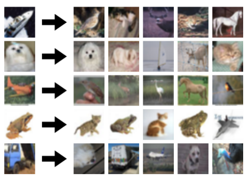
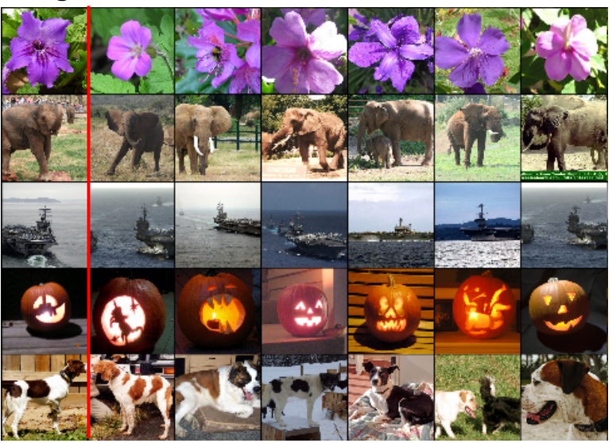
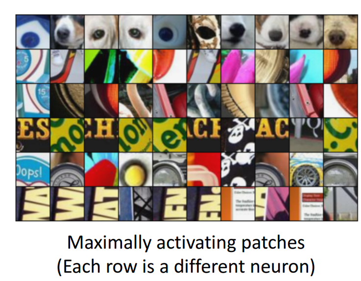
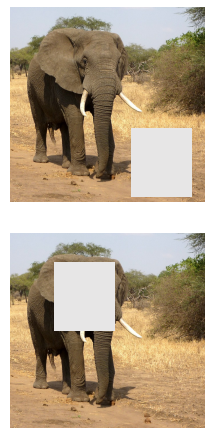

# Visualizing and Understanding CNNs
 
## 1. Feature Learning in CNNs

CNNs learn features **hierarchically**:

- **Early layers**
  - Edges
  - Corners
  - Colors

- **Middle layers**
  - Textures
  - Object parts

- **Deep layers**
  - Objects
  - High-level semantic meaning

*CNNs move from **simple visual patterns** to **abstract concepts**.*

---

## 2. Filter Visualization

- Visualize convolution filters as images
- Most useful in the **first layer**
- Shows edge and color detectors

*Deep-layer filters are difficult to interpret visually.*

---

## 2. Activation Maps

- Visualize feature maps for an input image
- Answer: **Where does the CNN look?**
- High activation = important image region

*Used to verify whether the **CNN focuses on the object or background**.*

### Filter vs Feature maps Visualization:

<image src="https://miro.medium.com/v2/resize:fit:1100/format:webp/1*ixuhX9vaf1kUQTWicVYiyg.png">

---

## 3. Nearest Neighbors

### Nearest neighbors in pixel space
- Compare raw pixel values
- Sensitive to noise and color changes

### Nearest neighbors in feature space
- Compare CNN feature vectors
- Capture **semantic similarity**

**Feature-space neighbors are more meaningful.**

---

## 5. Dimensionality Reduction

Used to visualize high-dimensional CNN features.

### PCA
- Linear
- Fast
- Shows global structure

### t-SNE
- Non-linear
- Slower
- Shows clusters clearly

<image src="https://www.sc-best-practices.org/_images/dimensionality_reduction.jpeg">

---

## 6️. Maximally Activating Patches

- Find image patches that strongly activate a neuron
- Show **neuron specialization**
- Examples: eyes, wheels, text

> [!NOTE]
> Reveals what each neuron prefers.
---

## 7. Saliency Maps – Which Pixels Matter?

Used for explainability and interpretability.

### A) Saliency by occlusion

- Mask parts of the image
- Measure change in class score
- Intuitive but slow

### B) Saliency by backpropagation
- Compute gradient of class score
- Compute probabilities
- Fast but noisy

### C) Segmentation without Supervision
- Use GrabCut on saliency map

### D) Guided backpropagation
Find the part of an image that a neuron	responds to.
- Only positive gradients through ReLU
- Clearer saliency maps

<image src="https://i.ytimg.com/vi/bZFY_uOeEnI/hq720.jpg?sqp=-oaymwEhCK4FEIIDSFryq4qpAxMIARUAAAAAGAElAADIQj0AgKJD&rs=AOn4CLAf4C97v7meRK_-b0I22qcM5v3J0Q">

---

## 8. Gradient Ascent (Class Visualization)

Generate a synthetic image that maximally activates a neuron.
- Start from random/zeros noise
- Modify image to maximize class score
- Visualizes what a class means to the CNN
- Requires regularization (L2)

| Guided backprop  | Gradient Ascent |
| ------------- | ------------- |
| **Find the part** of an image that a neuron	responds to.  | **Generate a synthetic** image that maximally activates a neuron  |

---

## 9. Adversarial Examples

- Very small perturbations
- Cause incorrect classification
- Invisible to humans

<image src="https://spylab.ai/blog/chatbot-adversarial-examples/cat_hu3b1931cb4f22e25577c3f973e34f3422_6295646_c4c5c1ba5dace4b9133acbd3cb8ea017.webp" width="512">

Adversarial examples can be generated by:
1. Start from an arbitrary image
2. Pick	an	arbitrary	category
3. Modify the image	(via gradient ascent) to maximize the class score
4. Stop	when the network is fooled
 
> [!IMPORTANT]
> Demonstrates lack of robustness in CNNs.

---

## 10. Feature Inversion

- Reconstruct images from CNN features that 
    - *looks natural* 
    - *Matches the given feature vector*.

<image src="https://towardsdatascience.com/wp-content/uploads/2020/11/1uP5x5K49IK3PUKCczq2dgA.png" width="512">

---

## 11. DeepDream

DeepDream is a visualization method applied to convolutional neural networks in order to **create new images based on pre-existing features within a base image**.

- Amplifies **existing** CNN neuron activations
- Produces dream-like visual effects

<image algin="center" src="https://miro.medium.com/v2/resize:fit:1400/0*dRaGNNOhDOQWZbJD" width="512">

> [!NOTE]
> DeepDream is able to create new entirely images which tend to be much more psychedelic and dreamy in nature, hence the name DeepDream.
*Artistic visualization of CNN features.*

---

## 12. Texture Synthesis and Gram Matrix

Used for texture generation.

- **Nearest	Neighbor**: Generate pixels one at a time in scanline order form neighborhood
- **Gram matrix**: captures correlations between feature channels
 - Ignores spatial location
 - Represents texture statistics

<image algin="center" src="https://www.tech-art.org/wp-content/uploads/2019/03/GreenPatternResult-768x384.png" widht="512">

---

## 13. Neural Style Transfer

Reconstructing	texture	from higher	layers recovers	larger features from	the	input texture
- **Content loss** preserves structure
- **Style loss (Gram matrix)** transfers texture
 
#### Problem: Style transfer	requires many forward/backward passes through	VGG; **very slow!**

### Solution: Fast Neural Style Transfer

Neural network to perform style transfer	

1. Train a feedforward	network	for	each style
2. Use	pretrained CNN to compute	same losses	as before
3. After training, stylize images using a single forward pass

<image src="https://av-eks-lekhak.s3.amazonaws.com/media/__sized__/article_images/image_yurllWj-thumbnail_webp-600x300.webp">

---

---

# Exam & Questions

### Q1. Why is filter visualization most useful in the first layer?
**Answer:**  
Because the first layer operates directly on RGB pixels, making filters interpretable as edges and colors.

---

### Q2. What is the difference between pixel space and feature space nearest neighbors?
**Answer:**  
Pixel space compares raw pixels, while feature space compares CNN features and captures semantic similarity.

---

### Q3. What do activation maps show?
**Answer:**  
They show which regions of the image activate specific feature maps.

---

### Q4. Why is t-SNE preferred over PCA for visualization?
**Answer:**  
Because t-SNE better reveals clusters and local structure, although it is slower.

---

### Q5. What is the purpose of maximally activating patches?
**Answer:**  
To understand what visual patterns a neuron responds to most strongly.

---

### Q6. Compare occlusion and backpropagation saliency.
**Answer:**  
Occlusion is intuitive but slow, while backpropagation is fast but noisy.

---

### Q7. What problem do adversarial examples reveal?
**Answer:**  
They show that CNNs can be fooled by very small, human-imperceptible changes.

---

### Q8. What information is preserved in deep CNN layers?
**Answer:**  
High-level semantic information rather than fine image details.

---

### Q9. Why is Gram matrix used for texture and style?
**Answer:**  
Because texture depends on feature correlations rather than spatial arrangement.

---

### Q10. Why is fast style transfer faster than the original method?
**Answer:**  
Because it uses a trained feedforward network instead of iterative optimization.

