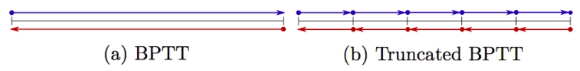
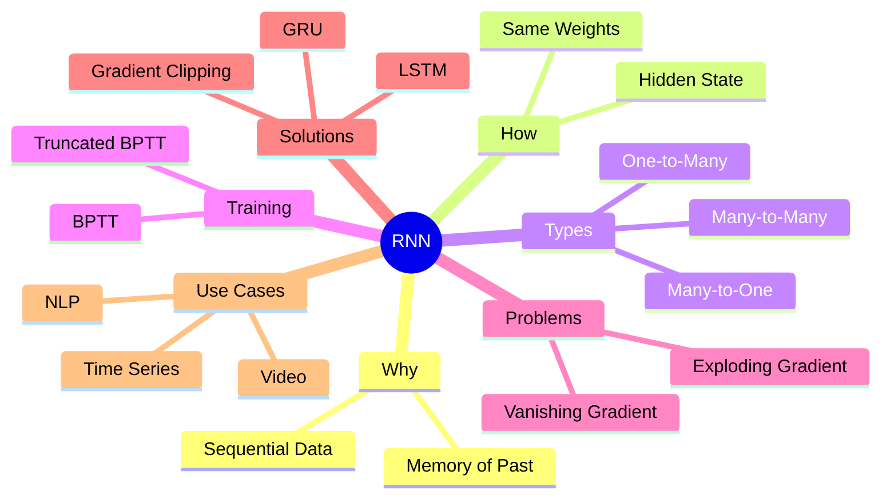

# Recurrent Neural Networks (RNN)

## 1. Why Recurrent Neural Networks?

Traditional **Feedforward Neural Networks** assume that inputs are independent.
However, many real-world problems involve **sequential data**, where:
- Order matters
- Past information affects future predictions

RNNs are designed to model **temporal dependencies**.

### Examples of Sequential Data
- Text (sentences, documents)
- Speech signals
- Video frames
- Time-series (weather, stock prices, sensors)

---

## 2. Core Idea of RNN

An RNN processes inputs **one timestep at a time**, maintaining an internal memory
called the **hidden state**.

At each timestep `t`:
- Input: `x_t`
- Previous hidden state: `h_{t-1}`
- Output: `h_t`


### Key Properties
- Same weights are **reused** at every timestep
- The hidden state summarizes past information
- Enables modeling of **sequences of long length**


---

## 3. RNN Input–Output Architectures (Very Important for Exams)

<image src="https://i.sstatic.net/b4sus.jpg">


| Architecture | Description | Example |
|-------------|------------|---------|
| One-to-One | Single input → single output | Image classification |
| One-to-Many | One input → sequence | Image captioning |
| Many-to-One | Sequence → single output | Sentiment analysis |
| Many-to-Many | Each input has an output | Video frame labeling |
| Sequence to Sequence (seq2seq) | Sequence → sequence | Machine translation / Summary|


---

## 4. Language Modeling (Canonical Example)

### Task
Predict the **next token** (character or word) given previous tokens.

### Training Example
Vocabulary = {h, e, l, o}

- Input: `"h"` → Target: `"e"`
- Input: `"he"` → Target: `"l"`
- Input: `"hel"` → Target: `"l"`
- Input: `"hell"` → Target: `"o"`

### Inference (Text Generation)
1. Start with an initial token
2. Predict next token using softmax
3. Sample a token
4. Feed it back as input
5. Repeat until `<END>` token

---

## 5. Input Representation

### One-Hot Encoding
- Simple
- Very high dimensional
- No semantic similarity

<image src="https://miro.medium.com/1*ggtP4a5YaRx6l09KQaYOnw.png" width="512" hight="512"  />

### Embedding Layer
- Dense vector representation
- Learns semantic relationships
- Efficient for large vocabularies

<image src="https://arize.com/wp-content/uploads/2022/06/blog-king-queen-embeddings.jpg" width="512" hight="512" >

<br/>

**Embeddings are preferred in practice.**

---

## 6. Training RNNs: Backpropagation Through Time (BPTT)

### Standard BPTT
- Forward pass through entire sequence
- Backward pass through entire sequence

### Problems
- High memory consumption
- Slow for long sequences

### Truncated BPTT
- Backpropagate only for a fixed number of timesteps
  - *Run	forward	and	backward through	**chunks	of	the sequence** instead of whole	sequence*
- Hidden states are still carried forward
  -	only	backpropagate	for	some	smaller	number of	steps
- Practical and widely used



---

## 7. Gradient Problems in Vanilla RNNs

### Vanishing Gradient
- Gradients shrink exponentially
- Model fails to learn long-term dependencies

### Exploding Gradient
- Gradients grow uncontrollably
- Training becomes unstable

### Solutions
#### Exploding gradients:
- **Gradient clipping**: Scale gradient if	its	norm is too big
#### vanishing gradient:
- **Architectural changes**: Change	RNN	architecture

---

## 8. Long Short-Term Memory (LSTM)

LSTM is designed to **preserve long-term information**.

### Key Components
- Cell state (long-term memory)
- Hidden state (output)

### Gates
| Gate | Function |
|----|---------|
| Forget Gate | What information to discard |
| Input Gate | What information to store |
| Output Gate | What information to expose |

### Why LSTM Works
- Additive memory updates
- Stable gradient flow across time
- Solves vanishing gradient problem

---

## 9. Gated Recurrent Unit (GRU)

- Simplified version of LSTM
- Fewer gates
- Faster to train
- Similar performance in many tasks


<image src="https://miro.medium.com/max/1280/1*yBXV9o5q7L_CvY7quJt3WQ.png" width="512">

---

## 10. Single-layer vs Multi-layer RNNs

### Single-layer RNN
- One recurrent layer
- Simpler, fewer parameters

### Multi-layer (Stacked) RNN
- Hidden states of one layer feed the next
- More expressive
- Used in complex tasks (speech, translation)

---

## 11. CNN + RNN (Image Captioning)

Pipeline:

```
Image → CNN → Feature Vector → RNN/LSTM → Sentence
```


- CNN extracts spatial features
- RNN generates word sequence
- Widely used in vision-language tasks

---

## 12. Extended Use Cases of RNNs (Important)

### Natural Language Processing
- Language modeling
- Machine translation
- Text summarization
- Named Entity Recognition (NER)
- Question answering

### Speech & Audio
- Speech recognition
- Speaker identification
- Emotion recognition from voice

### Computer Vision
- Image captioning
- Video classification
- Action recognition
- Per-frame labeling

### Time-Series Analysis
- Stock price prediction
- Weather forecasting
- Energy consumption prediction
- IoT sensor anomaly detection

### Healthcare
- Patient monitoring
- ECG / EEG signal analysis
- Disease progression modeling

### Cybersecurity
- Network traffic anomaly detection
- Log sequence analysis
- Intrusion detection systems

---

## 13. Common Exam Questions (MCQ)

**Q1. What is the main advantage of RNNs over feedforward networks?**  
A) Faster training  
B) Lower memory usage  
C) Ability to model sequential dependencies  
D) No need for backpropagation  

✔ Answer: C

---

**Q2. What problem does LSTM mainly solve?**  
A) Overfitting  
B) Exploding gradients  
C) Vanishing gradients  
D) Large datasets  

✔ Answer: C

---

**Q3. Which task is Many-to-One?**  
A) Image captioning  
B) Machine translation  
C) Sentiment analysis  
D) Text generation  

✔ Answer: C

---

**Q4. Why are embeddings better than one-hot vectors?**  
A) They are binary  
B) They reduce dimensionality and capture semantics  
C) They do not require training  
D) They remove the need for RNNs  

✔ Answer: B

---
### Practical & Applied Questions

This README contains **practical, application-based questions** commonly asked in
final exams for Recurrent Neural Networks (RNN).
The focus is on **architecture selection, reasoning, and problem diagnosis**.

---

## 1. Architecture Selection

### Question 1
You are given a dataset of **movie reviews**.
Each review is a sequence of words, and the goal is to classify the review as
**positive or negative**.

**Tasks:**
1. Identify the correct RNN input–output architecture.
2. Is a Vanilla RNN sufficient?
3. What model would you recommend and why?

**Answer:**
- Architecture: Many-to-One
- Vanilla RNN struggles with long-term dependencies
- LSTM or GRU is recommended

---

## 2. Identify RNN Types

### Question 2
Match each task with the correct RNN architecture:

| Task | Architecture |
|----|-------------|
| Image captioning | ? |
| Speech-to-text | ? |
| Video classification | ? |
| Per-frame video labeling |? |

---

## 3. Language Modeling (Step-by-Step Reasoning)

### Question 3
You are training a **character-level language model** using the word `"data"`.

**Tasks:**
1. List the input–target pairs during training.
2. Describe what happens during inference.

**Answer:**
- Training pairs:
  - `"d"` → `"a"`
  - `"da"` → `"t"`
  - `"dat"` → `"a"`
- During inference:
  - The model predicts one character at a time
  - The predicted character is fed back as input

---

## 4. One-Hot Encoding vs Embeddings

### Question 4
You are working with a vocabulary of **50,000 words**.

**Tasks:**
1. Explain why one-hot encoding is inefficient.
2. Explain why embeddings are preferred.

**Answer:**
- One-hot vectors are high-dimensional and sparse
- Embeddings:
  - Reduce dimensionality
  - Capture semantic similarity
  - Improve efficiency

---

## 5. Training Failure Diagnosis

### Question 5
During RNN training, you observe:
- Loss suddenly becomes `NaN`
- Gradients grow extremely large

**Tasks:**
1. Identify the problem.
2. Suggest a solution.

**Expected Answer:**
- Problem: Exploding gradients
- Solution: Gradient clipping

---

## 6. Long-Term Dependency Problem

### Question 6
An RNN fails to learn the dependency between the **first and last words**
in a long sentence.

**Tasks:**
1. Identify the cause.
2. Explain why Vanilla RNN fails.
3. Provide a solution.

**Answer:**
- Cause: Vanishing gradient
- Repeated multiplication by small values
- Use LSTM or GRU

---

## 7. BPTT vs Truncated BPTT

### Question 7
You are training an RNN on very long **sensor time-series data**.

**Tasks:**
1. Why is standard BPTT problematic?
2. What training strategy is used in practice?

**Expected Answer:**
- BPTT requires high memory
- Truncated BPTT is used

---

## 8. CNN + RNN Case Study (Image Captioning)

### Question 8
Design a system that generates a sentence describing an image.

**Tasks:**
1. What models are used?
2. What is the role of each model?

**Answer:**
- CNN extracts image features
- RNN/LSTM generates word sequence
- Architecture: One-to-Many

---

## 9. Model Selection Justification

### Question 9
You must choose between **Vanilla RNN, LSTM, and GRU** for a
**speech recognition** task.

**Task:**
Which model do you choose and why?

**Answer:**
- Speech involves long-term temporal dependencies
- LSTM or GRU preferred
- GRU if computational efficiency is important

---

## 10. Sequence-to-Sequence Reasoning

### Question 10
Explain why **Seq2Seq architecture** is used in machine translation.

**Answer:**
- Input and output sequences have different lengths
- Encoder summarizes input sequence
- Decoder generates output sequence
- Handles variable-length sequences

---

### Question 11
Explain why **LSTM allows stable gradient flow**, while Vanilla RNN does not.

**Answer:**
- LSTM uses additive cell state updates
- Avoids repeated matrix multiplications
- Enables uninterrupted gradient flow

---

## 14. Mind Map 


---

## 15. Final Revision

- RNNs	allow	a	lot	of	flexibility	in	architecture	design
- Vanilla	RNNs	are	simple	but	don’t	work	very	well
- Common	to	use	LSTM	or	GRU:	additive	interactions	improve	gradient	flow
- Backward	flow	of	gradients	in	RNN	can	explode	or	vanish.
- Exploding	is	controlled	with	gradient	clipping.
- Vanishing	is	controlled	with	additive	interactions	(LSTM)
- Better/simpler	architectures	are	a	hot	topic	of	current	research
- Better	understanding	(both	theoretical	and	empirical)	is	needed.