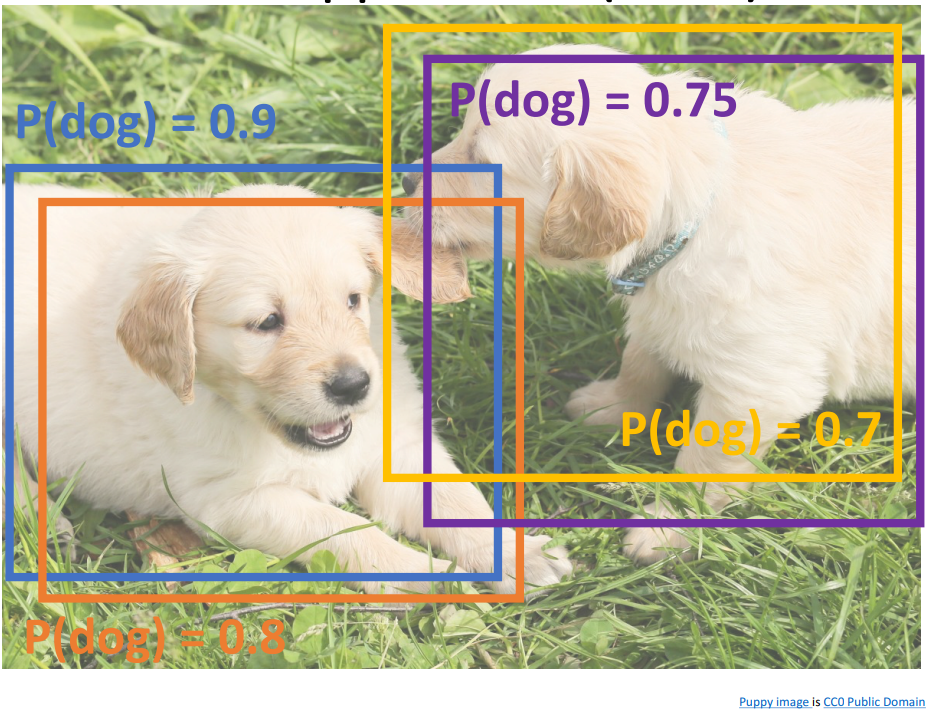
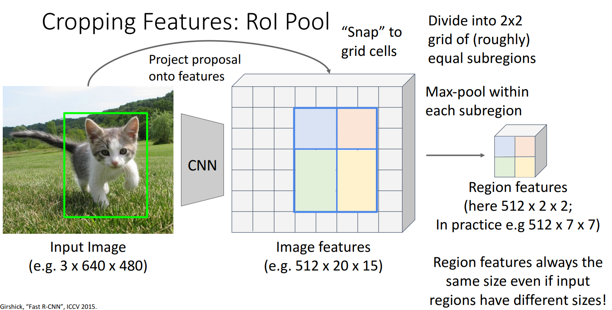
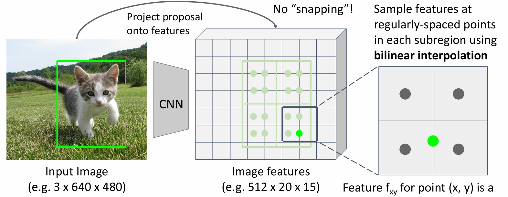

# Object Detection with CNNs

## What is Object Detection ?

Given an input image, object detection outputs **multiple predictions**,  
each prediction contains:

- A **class label**
- A **bounding box** (x, y, width, height)
- A **confidence score**

### Computer	Vision	Tasks
- Classification	
- Semantic Segmentation
- Object Detection
- Instance Segmentation

<image src="https://bigblue.academy/uploads/images/blog/computer-vision/computer-vision-tasks.jpg.jpg" width="512">

---

## 1. The Core Difficulty in Object Detection

The network must solve **two problems at once**:

- **Multiple	outputs:**	Need	to	output	
variable	numbers	of	objects	per	image.
- **Multiple	types	of	output:**	Need	to	
predict	”what”	(category	label)	as	well	
as	“where”	(bounding	box).
- **Large	images**.

#### Output: **class label + bounding box**

## Sliding	Window

Apply	a	CNN	to	many	different	
crops	of	the	image,	CNN	classifies	
each	crop	as	object	or	background

<image src="https://miro.medium.com/v2/resize:fit:956/1*pLtq170Jg1RmJRWEewk5NQ.gif">

#### Problem: 800	x 600 image has ~58M boxes! No way we can evaluate them all

---

## 2. R-CNN (Original Region-based CNN)
Find	a	small	set	of	boxes	that	are	likely	to	cover	all	objects

### Step-by-step Pipeline

1. Generate ~2000 region proposals using **Selective Search (CPU)**
2. Warp each region to fixed size (e.g. 224×224)
3. Run CNN **independently** on each region
4. Output:
   - Class scores
   - Bounding box regression

<image src="https://media.geeksforgeeks.org/wp-content/uploads/20200219161502/RCNN1.png">

### Why is R-CNN slow?

- CNN is executed **2000 times per image**
- No shared computation
- Training and inference are both slow

### Comparing Boxes: Intersection over Union (IoU)

How	can	we	compare	our	prediction	to	the	ground-truth box?
- Intersection over Union (IoU)

<image src="https://idiotdeveloper.com/wp-content/uploads/2023/01/iou-1024x781.webp" width="512">

### Overlapping Boxes Issue

**Problem:** 
Object detectors often output many overlapping detections

**Solution:**	
Post-process raw detections	using Non-Max Suppression(NMS)
1. Select	next	highest-scoring	box
2. Eliminate	lower-scoring	boxes	
with	IoU >	threshold	(e.g.	0.7)
3. If	any	boxes	remain,	GOTO	1

*Non-Max Suppression keeps the **highest-confidence bounding** box and **removes other boxes** that overlap with it above a chosen IoU threshold.*

**Still Problem:**

NMS may eliminate *good* boxes when objects	are	highly overlapping, no good solution.

### Evaluating	Object	Detectors:	
**Mean Average Precision (mAP)** measures how well an object detector finds objects and how accurate its bounding boxes are.

- Detection correctness (Is the object detected?)
- Localization accuracy (Is the box correct?)
- Confidence ranking (Are good detections ranked first?)

---

## 3. Fast R-CNN

### Main idea
**Run the CNN once per image**, not per region like "slow RNN".

### Detailed Pipeline

1. Input image
2. Image Processing with a CNN Backbone → feature map
3. Region Proposal (RoI) via Selective Search
3. For each RoI **crop features using RoI Pooling**
4. For each RoI:
   - Class prediction
   - Bounding box regression

<image src="https://miro.medium.com/v2/resize:fit:1100/format:webp/0*Hw4sfqFmVyUAI9TW.jpeg">

### What improved?

- Shared convolutional computation
- Faster training
- Faster inference

### Remaining problem

Region proposals still computed by **Selective Search on CPU**

---

## 4. Faster R-CNN (Major Breakthrough)

### Main idea

Faster R-CNN introduced **Insert Region Proposal Network (RPN)** to predict proposals from features rather than selective search.

<image src="https://media.geeksforgeeks.org/wp-content/uploads/20200219125702/faster-RCNN.png">

 

### Step by step:

1. **Backbone:** The image is converted into a convolutional feature map.
2. **Anchors:** The RPN generates reference boxes (anchors) across the feature map.
3. **Classification:** Each anchor is scored as either an object or background.
4. **Regression:** The coordinates of the object anchors are refined to fit the object perfectly.

### Train with 4 losses

1. **RPN	classification:**	anchor	box	is	
object	/	not	an	object
2. **RPN	regression:**	predict	transform	
from	anchor	box	to	proposal	box
3. **Object	classification:**	classify	
proposals	as	background	/	object	
class
4. **Object	regression:**	predict	transform	
from	proposal	box	to	object	box

> Image → Backbone (Features) → RPN (Anchors) → Classification (Is it an object?) + Regression (Fix the box).
---

## 5. Cropping	Features: 

### 5.1 RoI Pooling

#### How RoI Pooling works

1. Project region proposal onto feature map
2. Snap to **fixed grid cells** (e.g. 2×2)
3. Apply max pooling in each cell
4. Output fixed-size feature map

**Problem:**
> Slight misalignment due to snapping; different-sized subregions

### 5.2 RoI Align (used in Mask R-CNN)

1. Project the RoI onto the feature map
2. Divide into equal-sized **subregions**
3. Sample exact values using **bilinear interpolation**
4. Aggregate values (usually average or max)

### RoI Pooling vs RoI Align
- **RoI Pooling:** Uses quantization, faster but less accurate
- **RoI Align:** No quantization, uses interpolation, more accurate

---

### Region Proposal Network (RPN) – In Detail

Faster R-CNN is	a Two-stage	object	detector
1. First	stage:	Run	once	per	image
    - Backbone	network
    - Region proposal network
2. Second	stage:	Run	once	per	region
    - Crop	features: RoIpool/align
    - Predict object class
    - Prediction box

<image src="https://miro.medium.com/v2/resize:fit:676/1*rmrribXQk7I5Vzh7javvPA.png">

#### Q) Do We Really Need the Second Stage in Object Detection?
No, the second stage is not strictly required, but it improves accuracy.

#### Q) What Happens If We Remove the Second Stage?
This leads to single-stage detectors.

---

### Comparison: R-CNN Variants

| Model | CNN Runs | Proposal Method | Speed |
|------|---------|----------------|-------|
| R-CNN | Per region | Selective Search | Very slow |
| Fast R-CNN | Once per image | Selective Search | Faster |
| Faster R-CNN | Once per image | RPN | Fastest |

---

## 6. Two-Stage vs Single-Stage Detectors

### Two-stage detectors
- Proposal → classification
- Example: Faster R-CNN
- Higher accuracy

### Single-stage detectors
- Direct prediction
- No proposal stage
- Faster inference

📌 Historically less accurate, but improving.

---

## 7. YOLO (You Only Look Once)

### What is YOLO?
**YOLO is a single-stage object detector** that predicts:
- Bounding boxes
- Class labels
- Confidence scores

All in **one forward pass of the network**.

---

### Key Idea
**YOLO formulates object detection as a single regression problem**  
from image pixels directly to bounding boxes and class probabilities.

---

### How YOLO Works (Step by Step)

1. The input image is divided into a **grid**
2. Each grid cell predicts:
   - Bounding box coordinates
   - Object confidence score
   - Class probabilities
3. All predictions are produced **simultaneously**
4. **Non-Max Suppression (NMS)** removes duplicate overlapping boxes

- No region proposals  
- No second stage  

---

### YOLO vs Two-Stage Detectors

| Aspect | YOLO | Faster R-CNN |
|------|------|--------------|
| Number of stages | One | Two |
| Region proposals | No | Yes (RPN) |
| Speed | Very fast | Slower |
| Accuracy | Lower (historically) | Higher |
| Real-time use | Yes | Usually no |

---

### Why YOLO is Fast
- Single CNN forward pass
- No proposal generation
- **real-time object detection**.

---

### Limitations of YOLO
- Difficulty detecting **small objects**
- Struggles in **crowded scenes**
- Lower localization accuracy compared to two-stage detectors

These limitations explain **why two-stage detectors are still used**.

---

# Questions

### Q1. Why does R-CNN require so much computation?
**Answer:**  
Because it runs the CNN independently on thousands of region proposals.

---

### Q2. What problem does RoI Pooling solve?
**Answer:**  
It converts variable-sized regions into fixed-size feature maps required by the classifier.

---

### Q3. Why is Faster R-CNN faster than Fast R-CNN?
**Answer:**  
Because region proposals are learned using RPN instead of CPU-based Selective Search.

---

### Q4. What does the RPN predict at each spatial location?
**Answer:**  
Objectness scores and bounding box offsets for multiple anchor boxes.

---

### Q5. Why are anchor boxes necessary?
**Answer:**  
They allow detection of objects with different sizes and aspect ratios.

---

### Q6. What is the main difference between two-stage and single-stage detectors?
**Answer:**  
Two-stage detectors first generate proposals, while single-stage detectors predict objects directly.
